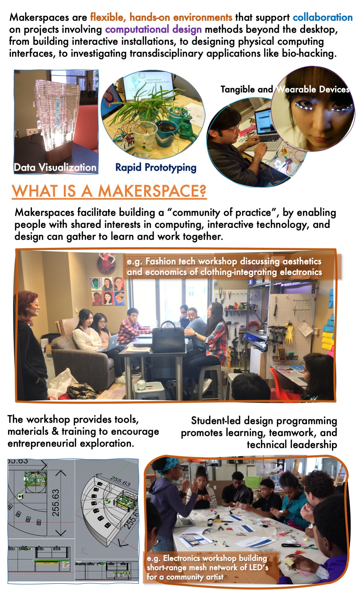

# Berea College Makerspace Website Documentation
Welcome to the documentation for the Berea College Makerspace website. This guide will provide you with information on how the program is managed and how to work with the Git repository.

# Table of Contents
1. Overview
2. Getting Started
   - Requirements
   - Clone the repository
3. Website Structure
4. Testing
5. Contributing
6. Contact

# Overview
Academic makerspaces are like playgrounds for learning and developing creative skills. We provide the tools and materials, and you provide the ideas! Our makerspace at Berea currently focuses on computational projects-- ranging from digital art to robotics, to e-textiles. We encourage collaborative projects and peer mentoring-- come learn and share your skills!

This website is primarily for promotion and awareness of the space and what we offer. Active engagement and event announcements happen on our [Instagram!](https://www.instagram.com/bcmakerspace/) 

This repo is the website for Berea College Makerspace. This document will guide you on how to clone the Git repository and provide an overview of each file and function.

# Getting Started
# Requiremnts
Make sure you have the following prerequisites installed on your system:

1. Git
2. A modern web browser (e.g., Chrome, Firefox)
3. Visual Studio Code (Assumed)

# Clone the Repository
To get started, you need to clone the Git repository. Open your terminal and run the following command:

"git clone https://github.com/bereacollegemakerspace/bereacollegemakerspace.github.io.git"

# Testing
If you're using Visual Studio Code, you can install the "Live Server" extension for a more convenient development server.

Assuming Visual Studio Code is opened:

1. Navigate to the Extensions view (Ctrl+Shift+X).
2. Search for "Live Server" and install it.
3. Open the HTML file you want to test.
4. Right-click anywhere in the HTML file and select "Open with Live Server."

This will open your default web browser with the live version of the website.

# Contributing
If you would like to contribute to the Berea College Makerspace website, feel free to fork the repository, make your changes, and submit a pull request. 
Make sure to follow best practices and adhere to the coding style used in the existing codebase.

# Contact
For more information or if you have any questions, you can contact @jazzij 

Feel free to reach out for clarifications, suggestions, or any assistance related to the Berea College Makerspace website.

Happy coding!
